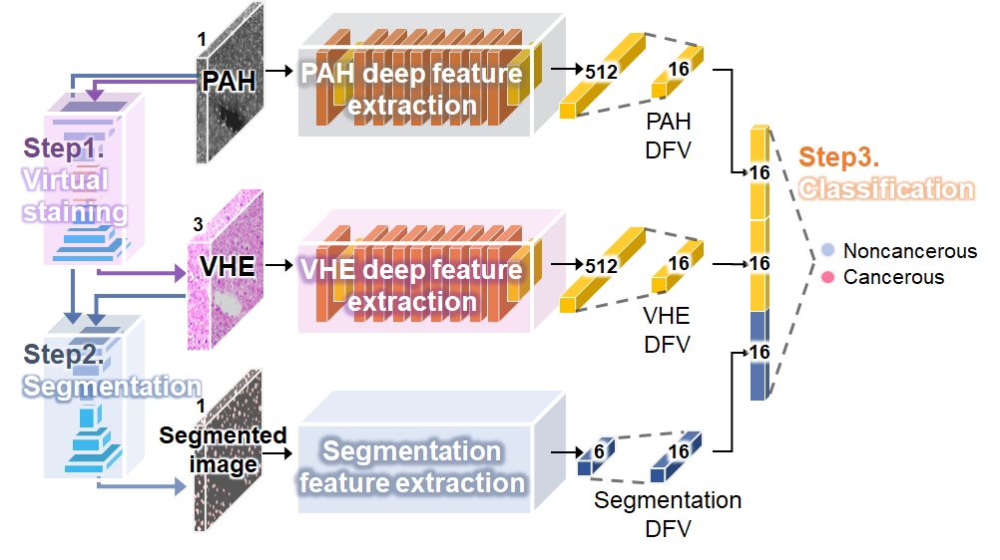

# DL-based-framework-for-automated-HIA-of-label-free-PAH-images

### System Requirements
The image pre-processing steps were implemented in MATLAB using R2021a (The MathWorks Inc.). 
All the virtual staining, segmentation, and classification sequences were implemented using Python, version 3.8.12, and Pytorch, version 1.11.0. We implemented this training and testing on a Linux system with one Nvidia GeForce RTX 3090 GPU, an AMD EPYC 7302 CPU, and 346GB of RAM.

# Stepwise feature fusion (StepFF) system

### Package Installation
RUN sh code/requirements.sh

### Data Preparation  
- datasets folder should be positioned at [s1_VirtualStain/datasets]  
datasets/HE
datasets/PAH

### Inference Code
python code/test.py --name sample \
--dataroot datasets --checkpoints_dir checkpoints --results_dir results --gpu_ids 0 --load_size 512 --crop_size 512 \
--isX --CUT_mode CUT \
--s2_model unet \
--s3_isfeature --s3_select_feat 0 1 2 3 4 5

## Expected Output
results will be saved in `results/s1_VirtualStain, s2_Segmentation, s3_Classification`
### Virtual stain 
- Virtual stain results should be saved in `datasets/VHE` and `results/s1_VirtualStain`
- Input PAH (with explainability components)  
-- results/.../test_latest/images/real_A  
-- results/.../test_latest/images/real_A_sig  
- Virtual staining results (with explainability components)  
-- results/.../test_latest/images/fake_B  
-- results/.../test_latest/images/fake_B_sig  
-- results/.../test_latest/images/fake_B_cam_IntegratedGradients  
- GT H&E (with explainability components)  
-- results/.../test_latest/images/real_B  
-- results/.../test_latest/images/real_B_sig
-- results/.../test_latest/images/real_B_cam_IntegratedGradients  
  
### Segmentation 
- Segmentation results saved in [*_p.png] format at `results/s2_Segmentation` folder
- Cell area detection results (image) saved in [*_c.png] format at results folder
- Cell area detection results (value) saved in [Anlaysis_results.txt] at results folder
- 
### Classification 
- Classification results saved in `results/s3_Classification` folder
- Classification results saved in [basic_result_history.csv] at results folder
